# Multi-Agents with Autogen and Semantic Kernel

This project showcases autogen (0.4) by presenting a set of simple scripts that create different type of agents and interactions between them with the purpose of highlighting the main capabilities of the agentic framework. This repo is based on [https://github.com/krishsub/MultiagentHackathon](https://github.com/krishsub/MultiagentHackathon).

## Getting Started

### Prerequisites

- Open AI service deployed with GPT-4o
- Azure Container Apps Session Pool

### Development environment

- Dev container option: The project provides a devcontainer configuration that can be used with github codespaces or your own local dev container. So, if you opt for this, you need to have docker on your system.
- Virtual Environment option: if you have python > 3.8 you could choose to create a venv and install all the requirements there.

#### Leverage AZD to deploy the prerequisites

You can leverage the [Azure Developer CLI](https://learn.microsoft.com/azure/developer/azure-developer-cli/), `azd` for short, to deploy the prerequisites to a subscription. It'll create the resources and export some environment variables which you can use to run the exercises. To leverage `azd` you need to have it installed and configured. After that, all it takes is a simple `azd up` and the components will be installed.

For a detailed explanation on what it deploys, check out the [README.md in the infra directory](/infra/README.md).

After the components have been deployed, you can navigate to [AI Foundry](https://ai.azure.com/) and obtain the Open AI Key and Endpoint. The Open AI endpoint, as well as the Azure Container Apps endpoint, will be stored in the `azd` environment variables. You can leverage those as well. The Open AI Key is not exposed in this manner for security considerations.

### Quickstart

#### Environment Variables

For this set of scripts, a gpt-4o model instance was used.
Create a `.env` file with your Azure OpenAI credentials in the `src` folder:

```bash
AZURE_OPENAI_API_KEY=your_api_key
AZURE_OPENAI_ENDPOINT=your_endpoint
```

#### Installation

Choose one of the following methods to run the different scripts. Make sure to `cd src`.

#### Option 1: Using uv (Recommended)

[uv](https://github.com/astral-sh/uv) is a fast Python package installer and runner. If you haven't installed it yet:

```bash
curl -LsSf https://astral.sh/uv/install.sh | sh
```

Then run the script directly (this will automatically install dependencies):

```bash
uv run 0X_SCRIPT_NAME.py
```

#### Option 2: Using pip

1. Install dependencies:

   ```bash
   pip install -r requirements.txt
   ```

2. Run the script:

   ```bash
   python 0X_SCRIPT_NAME.py
   ```


# Multi-Agent Hackathon Guide

## Introduction

Welcome to the MultiagentHackathon workshop! This project is designed to help you learn and practice implementing multi-agent systems using frameworks like AutoGen, Semantic Kernel, and more. The repository contains a series of progressive exercises that will guide you through building increasingly complex agent systems, from simple single-agent interactions to sophisticated multi-agent collaborative scenarios where code is executed in a dynamic Azure Container Apps Pool.

## Setup

### Prerequisites

- [Python](https://www.python.org/) 3.9+ installed
- An Azure OpenAI API key or OpenAI API key (For production ready deployments, you should refrain from using keys, and switch to [managed identities](https://learn.microsoft.com/entra/identity/managed-identities-azure-resources/overview))
- [Visual Studio Code](https://code.visualstudio.com/)

### Installation

1. Open Visual Studio Code (Link in your desktop)
2. Open a Powershell terminal using the upper menu `Terminal -> New Terminal` or by pressing CTRL+SHIFT+` (backtick). Make sure to select the Powershell terminal in the dropdown menu on the top right of the terminal window.
3. Clone the repository:

   ```Powershell
   git clone https://github.com/Azure-Samples/multi-agent-workshop
   cd multi-agent-workshop
   ```

4. Select open folder in your VS Code and open the `multi-agent-workshop` folder to see the code in your VS Code.
5. (**Optional, and takes some time**) Open your code in a devcontainer, using the Dev Containers plugin of VS Code and the devcontainer provided in the repo. Once the plugin is installed, if you open the `.devcontainer/devcotainer.json` file, it should ask you to re-open your repo in a devcontainer.
6. Install depedencies (might take a few minutes):

    [uv](https://github.com/astral-sh/uv) is a fast Python package installer and runner. If you haven't installed it yet:

    ```Powershell
    powershell -ExecutionPolicy ByPass -c "irm https://astral.sh/uv/install.ps1 | iex"
    $env:Path += ";C:\Users\Admin\.local\bin"
    uv sync
    ```

    **OR (without using uv)**

    ```bash
        python -m venv .venv
    ```

    ```powershell
        # On Windows
        .venv\Scripts\activate
    ```

    ```bash
        # On macOS/Linux
        source venv/bin/activate
    ```

    ```powershell
      curl https://bootstrap.pypa.io/get-pip.py -o get-pip.py
      python get-pip.py
      pip --version
    ```

    ```bash
        pip install -r requirements.txt
    ```

### Infrastructure Setup

#### Infrastructure as Code (Option 1 - Preferred)

You can leverage the [Azure Developer CLI](https://learn.microsoft.com/azure/developer/azure-developer-cli/), `azd` for short, to deploy the prerequisites to a subscription. It'll create the resources and export some environment variables which you can use to run the exercises. To leverage `azd` you need to have it installed and configured. After that, all it takes is a simple `azd up` and the components will be installed.

To install azd you can execute the following command in Powershell.

```Powershell
powershell -ex AllSigned -c "Invoke-RestMethod 'https://aka.ms/install-azd.ps1' | Invoke-Expression"
```

If using Linux, you can run:

```bash
curl -fsSL https://aka.ms/install-azd.sh | bash
```

For a detailed explanation on what it deploys, check out the [README.md in the infra directory](/infra/README.md).

After the components have been deployed, you can navigate to [AI Foundry](https://ai.azure.com/) and obtain the Open AI Key and Endpoint. The Open AI endpoint, as well as the Azure Container Apps endpoint will be stored in the azd environment variables. You can leverage those as well. The Open AI Key is not exposed in this manner for security considerations.

**Restart your VS Code** before running the next commands in the root folder of the repo.

```Powershell
azd auth login
```

To login follow the instructions and use the credentials for your Azure Subscription from the `Resources` tab

```Powershell
azd up  
```

And follow the instructions in the terminal to name your environment resources, make sure to select the correct subscription. We recommend choosing `Sweden Central` as Location.

#### Azure Portal (Option 2)

1. Navigate to the Azure Portal from the browser of your skillable lab `https://portal.azure.com/#home`
2. Login using the Username and Password available in the Resources tab
3. Open a new tab in your browser and go to `https://ai.azure.com` (you should be logged in already)
4. Create a new project, it should also setup a hub for you.
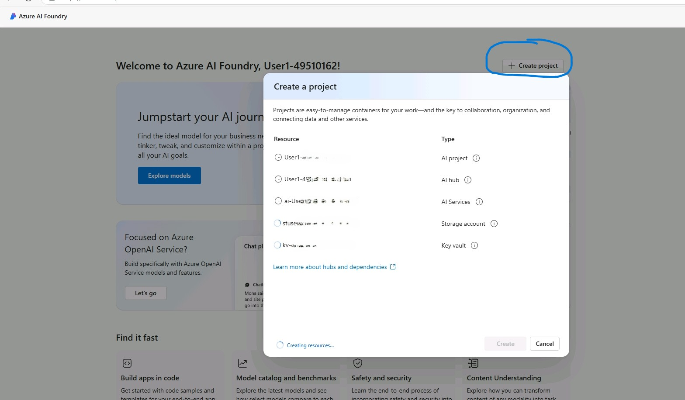
5. Deploy a GPT-4o model. You can follow the numbered steps in the screenshot below:
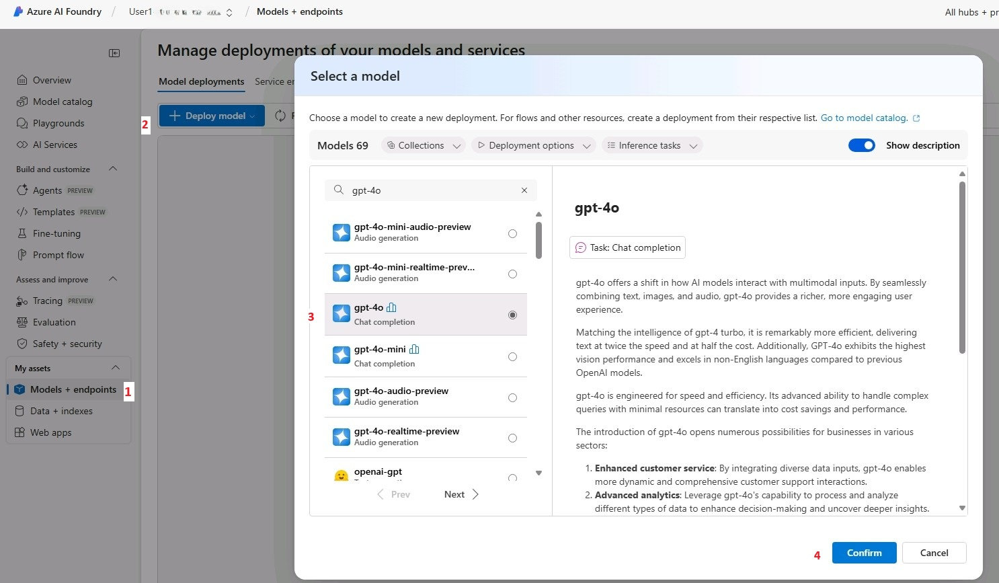
6. Go back to the Azure Portal, and create a Container App Session Pool. The screenshots below can guide you in the process:


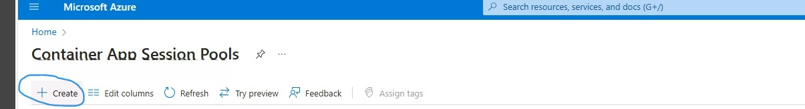

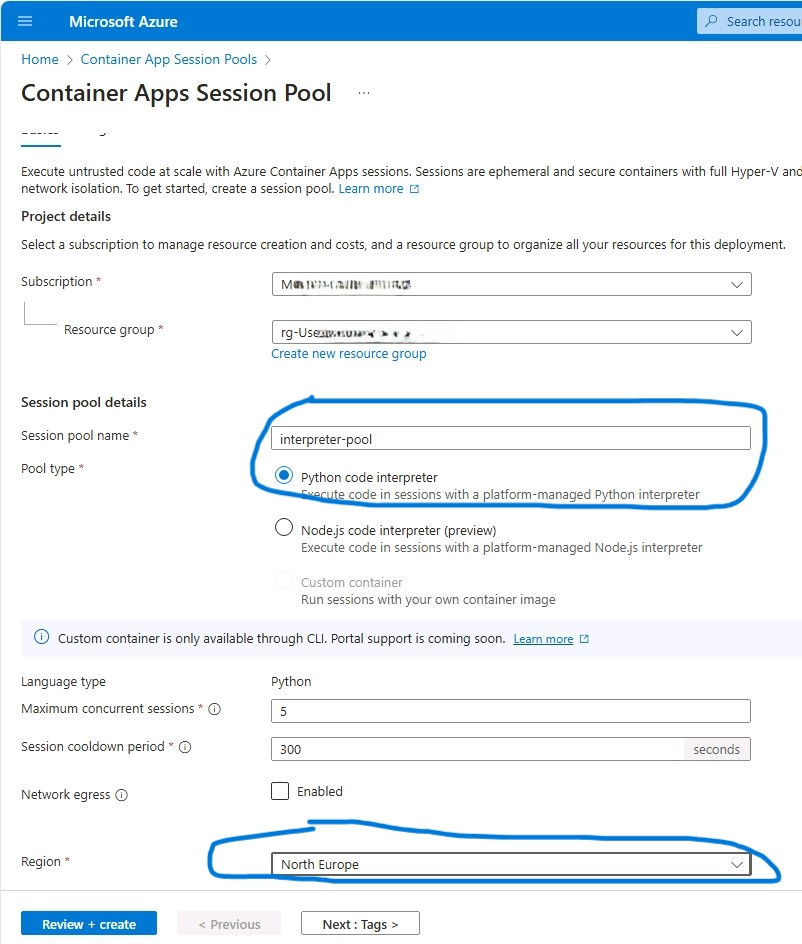

### Configuring your repository

1. Navigate to the *Azure Portal -> Resource Groups -> YOUR_RESOURCE_GROUP -> openai-YOUR_OWN_SUFFIX -> Explore Azure AI Foundry portal*. Make a note of the endpoint and key, you need then for step 3.  

You can also just go to `ai.azure.com` and in the overview of your project you should be able to see your credentials, similar to the ones visible in the picture below. 

The following screenshot show you how to get your credentials:
   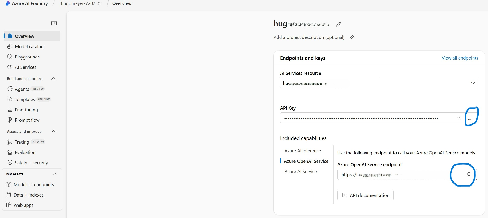

2. Navigate to *Azure Portal -> Resource Groups -> YOUR_RESOURCE_GROUP -> aca_pool-YOUR_OWN_SUFFIX* and get the Pool Management Endpoint.
   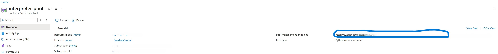

3. Set up environment variables:
   - Create a `.env` file in your `exercises` directory.
   - Add your API keys and endpoints (you could get this from the Azure Portal, make sure to have the values between quotes):

     ``` commandline
     AZURE_OPENAI_URL=your_azure_endpoint
     AZURE_OPENAI_API_KEY=your_azure_api_key
     ACA_POOL_MANAGEMENT_ENDPOINT=you_ACA_pool_endpoint
     ```

## Repository Structure

- [`src/`](/src/): Contains working examples of each exercise. We recommend you to not copy-paste solutions, but only look at this folder when you are stuck with an exercise and need some inspiration.
- [`exercises/`](/exercises/): Contains exercise templates for you to complete.

## Getting Started

Start with the first exercise and progress through them sequentially. Each exercise builds upon concepts introduced in the previous ones. Click Next when you are ready to continue.

===
## Introduction to Azure AI Agent Service 

Azure AI Agent Service is a fully managed service designed to empower developers to securely build, deploy, and scale high-quality, extensible AI agents without needing to manage the underlying compute and storage resources. This service simplifies the process of creating AI agents that can answer questions, perform actions, or automate workflows by combining generative AI models with tools that allow interaction with real-world data sources. 

Agent service offers several benefits:
- Ease of Use: What originally took hundreds of lines of code to support client-side function calling can now be done in just a few lines of code.
- Scalability: As a fully managed service, it allows you to focus on building workflows and agents without worrying about scaling, security, or infrastructure management.
- Integration: It uses the same wire protocol as Azure OpenAI Assistants, enabling seamless integration with OpenAI SDKs or Azure AI Foundry SDKs.For example, to create an AI Agent with Azure AI Foundry SDK, you can simply define which model the AI uses, the instructions for how it should complete tasks, and the tools it can use to access and interact with other services. 

### Getting started with Azure AI Agent Service in the AI Foundry portal

1. Navigate to the Agents Playground underneath "Build and customize" to select the gpt-4o model created through the portal earlier. 

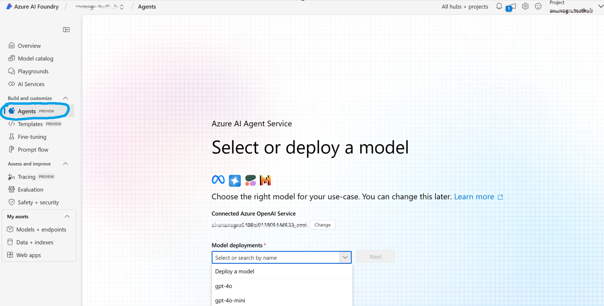

2. After selecting next you will receive a confirmation message that your agent is created, and your agent will also automatically be given a unique ID. Select the agent you just created and then click "Try in Playground" to the left.
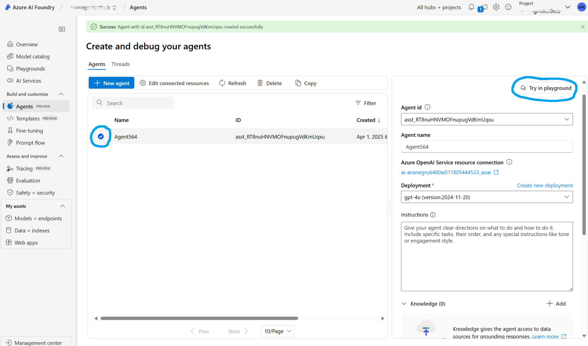

3. Once in the playground view add the following description to the instructions for the agent (in the `Instructions` placeholder on the right side of the screen):

```
You are a helpful assistant that can search files and answer questions based on the file content. You can utilize file search grounded on internal data to efficiently search through proprietary documents and provide accurate answers based on the content. This feature allows you to manage and index uploaded files for efficient keyword and semantic search, enhancing your ability to assist users with their queries.
            
You have access to a code interpreter tool that allows you to analyze data, create visualizations, and perform calculations. Be thorough and precise in your answers. For CSV and structured data, provide meaningful insights and summaries when appropriate.

Use the code interpreter when:
   1. Analyzing numerical data or statistics in CSV or JSON files
   2. Creating visualizations of data when it would help explain your answer
   3. Performing calculations or transformations on data
   4. Extracting specific information from complex structured data

 When using the code interpreter, follow these guidelines:
   - Write clear, concise code with comments explaining your approach
   - Use pandas for data analysis, matplotlib/seaborn for visualizations
   - Use descriptive variable names and follow best practices
   - Show intermediate steps for complex analyses
   - Interpret results for the user in plain language after showing code output
            
When creating visualizations:
   - Use clear titles, axis labels, and legends
   - Choose appropriate chart types for the data
   - Use matplotlib or seaborn for creating visualizations

```

4. Add a knowledge source for the agent and a code interpreter tool by clicking the + next to Knowledge & Actions. 

- When you upload data for file search in Azure AI Agent Service, a vector store is created to manage and search the uploaded files. This process involves several steps to ensure the data is properly indexed and searchable.
- First, the uploaded files are automatically parsed and chunked into smaller segments. Each chunk is then embedded, meaning it is converted into a vector representation that captures the semantic meaning of the content. These vectors are stored in a vector database, which supports both keyword and semantic search capabilities
- Once the vector store is created, it can be attached to both agents and threads, allowing for seamless integration and efficient file management across different AI applications
- The code interpreter tool enables agents to write and run Python code in a sandboxed environment. This feature is useful for tasks like generating graphs, performing calculations, and analyzing datasets. Agents can iteratively modify and rerun code until execution succeeds.

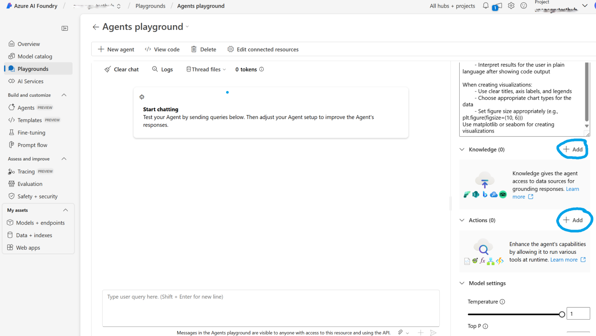

For the Knowledge Source click Files, and then Select Local Files to add and upload the `multi-agent-workshop/data/Internal Policy Document for Contoso Tech Support Agents.pdf` 

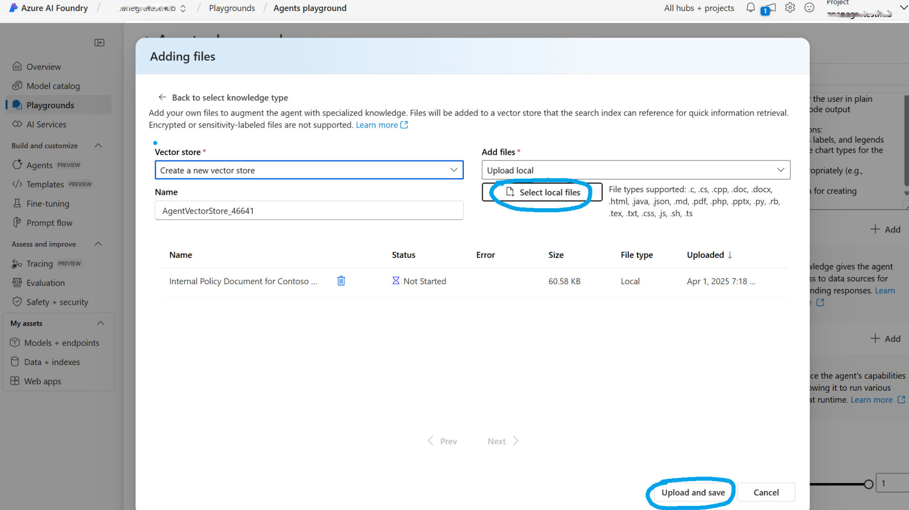

For the Actions, select Code Interpreter and then to add a Code Interpreter Action select `multi-agent-workshop/data/Contoso_Tech_Product_Data.csv` from local files and upload it to the Code Interpreter tool
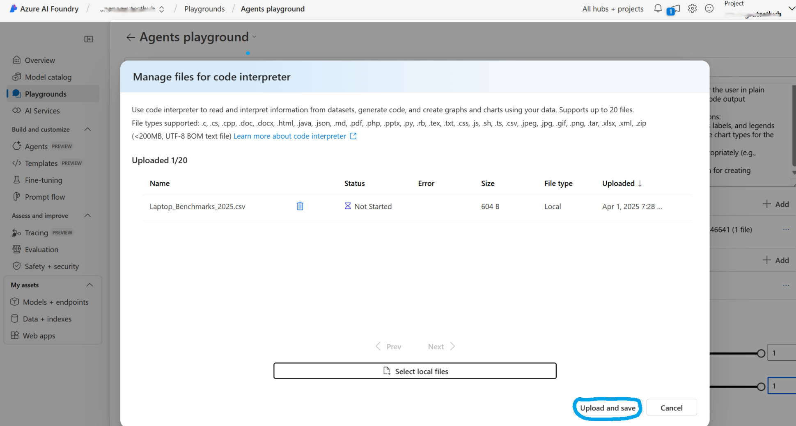

For context on the two files we have just uploaded:
- The pdf file is an Internal Policy Document for Contoso Tech Support Agents, which outlines the policies and procedures that support agents must follow when assisting customers. It covers key guidelines for handling returns, processing warranty claims, shipping options, order tracking, privacy policy, and customer support procedures. 
- The csv file provided contains sales data for various products sold by Contoso Tech. Each product is listed with its name, category, price, units sold, and the quarter in which the sales occurred. This data provides insights into the sales performance of different products over specific quarters. 

5. Chat with your agent 
Now you're free to ask your agent questions based on the data provided, here are some sample questions to try out and see how the agent responds. We can also ask for analysis based on the data provided. 

Questions for the policy document:
```
What are the key guidelines for handling returns at Contoso Tech?

Which items are non-refundable according to Contoso Tech's policy?

What are the contact details for Contoso Tech's support team?
```

Prompts for the laptop data:
```
Create a bar chart highlighting the top 5 products with the highest units sold.

Generate a pie chart showing the units sold for each product category. Include the number of units per category as well as percentages.
```

In this section we explored the Azure AI Agent Service, focusing on creating agents and adding tools like file search for searching through proprietary data and the code interpreter for data analysis. These features enable efficient data management, automated workflows, and insightful visualizations. The agent service playground provides a robust environment for experimenting with these tools and enhancing your projects. In the following section we explore how to get started with running and creating agents from a code-first point of view. 

===
## Exercise 0: Call a model

### Objective

Learn how to call your LLM model without using agents.

### Instructions

Refer to [`exercises/00_call_models.py`](/exercises/00_call_models.py) for a complete example.

```Powershell
 uv run .\exercises\00_call_models.py
```

OR (if you are not using uv)

```Powershell
python .\exercises/00_call_models.py
```

This is a very simple script that only calls the LLM deployed. It should serve as the starting point of the next exercises and should validate the connection to your LLM. If the code runs properly, you should see a joke created by the model in the terminal.

===

## Exercise 1: Single Agent

### Objective

Learn how to create and interact with a single AI agent.

### Instructions

Refer to [`exercises/01_single_agent.py`](/exercises/01_single_agent.py) for a complete example.

This is the foundation of agent-based systems. Understand how a basic agent system works before proceeding to more complex multi-agent scenarios.

===

## Exercise 2: Two Agents

### Objective

Implement a conversation between two agents (Chandler and Joey) who exchange jokes.

### Instructions

1. Open [`exercises/02_two_agents.py`](/exercises/02_two_agents.py)
2. Complete the TODOs in the file:
   - Create a `ChatCompletionClient` using the provided `llm_config`
   - Create two `AssistantAgent` instances with appropriate system messages:
     - Chandler should tell short story jokes related to friends
     - Joey should respond to jokes with another joke
     - Both should be able to end the conversation after 2 jokes by saying 'FINISH'
   - Create a termination condition using `TextMentionTermination`
   - Create a `RoundRobinGroupChat` team with both agents
   - Run the conversation and print the results
   - Reset the team and run another conversation as a stream
3. Documentation is available here: [Autogen Docs](https://microsoft.github.io/autogen/stable/index.html)

### Expected Outcome

Two agents exchanging jokes in a structured conversation that terminates after a set number of exchanges.

===

## Exercise 3: Two Agents Guessing Game

### Objective

Create a number guessing game where two agents interact: one tries to guess a random number, and the other provides feedback.

### Instructions

1. Open [`exercises/03_two_agents_guessing_game.py`](/exercises/03_two_agents_guessing_game.py)
2. Complete the TODOs in the file:
   - Create an OpenAI model client using `ChatCompletionClient.load_component()`
   - Create a guesser agent that tries to guess a number between 1-100
   - Create a player agent that provides feedback on guesses (too high/too low)
   - Set up a termination condition that ends the game when 'FINISH' is mentioned
   - Create a team with the two agents using `RoundRobinGroupChat`
   - Uncomment the code that runs the team chat to test your implementation
3. Documentation is available here: [Autogen Docs](https://microsoft.github.io/autogen/stable/index.html)

### Expected Outcome

A functional guessing game where agents take turns until the correct number is guessed.

===

## Exercise 4: Generate and Run Code in Conversations

### Objective

Build a system with two agents that can write and execute code collaboratively.

### Instructions

1. Open [`exercises/04_generate_and_run_code_in_conversations.py`](/exercises/04_generate_and_run_code_in_conversations.py)
2. Complete the TODOs:
   - Create a system message for the code writer agent with specific instructions
   - Set up a local command line executor using `LocalCommandLineCodeExecutor`
   - Create a code executor agent that uses this executor
   - Create a code writer agent with the system message defined earlier
   - Implement a termination condition for when "FINISH" is mentioned
   - Create a team with round-robin chat including both agents
3. Documentation is available here: [Autogen Docs](https://microsoft.github.io/autogen/stable/index.html)

### Expected Outcome

A system where one agent proposes Python code to calculate the 14th Fibonacci number, and another agent executes it. It is important to note that in this example, the `code_executor_agent` executes the code locally, can you think about reasons to avoid this?

===

## Exercise 5: Custom Agents Run Code

### Objective

Implement custom agents with code execution capabilities using the AutoGen Core framework. You can think of this code as an evolved or more production ready version of the previous exercise, where the agents interact for a longer time to solve a more complex problem. You will notice that the Assistant agent keeps track of the history of the conversation and keep working on the problem until the executor is able to provide the expected output.

### Instructions

1. Open [`exercises/05_custom_agents_run_code.py`](/exercises/05_custom_agents_run_code.py)
2. Complete the TODOs:
   - Initialize chat history with a SystemMessage in the Assistant class
   - Implement message handling logic for the Assistant
   - Create a function to extract code blocks from markdown text
   - Implement the message handler for the Executor agent
   - Complete the main function to set up and run the coding agents
   - Call the `coding_agents` function with `asyncio.run()`
3. Documentation is available here: [Autogen Docs](https://microsoft.github.io/autogen/stable/index.html)

### Expected Outcome

A system where an assistant generates code in markdown blocks, and an executor extracts and runs that code. After the code is executed succesfully, you should be able to see the output in the [`exercises/generated`](/exercises/generated/) folder.

===

## Exercise 6: Human in the Loop

### Objective

Create a human-in-the-loop interaction between an assistant agent and a user proxy agent.

### Instructions

1. Open [`exercises/06_human_in_the_loop.py`](/exercises/06_human_in_the_loop.py)
2. Complete the TODOs:
   - Create a `ChatCompletionClient` using the provided LLM configuration
   - Initialize an `AssistantAgent` with the created client
   - Initialize a `UserProxyAgent` to get user input from the console
   - Create a termination condition that ends when the user says "APPROVE"
   - Create a `RoundRobinGroupChat` team with the assistant and user proxy agents
   - Run the conversation and stream to the console
3. Documentation is available here: [Autogen Docs](https://microsoft.github.io/autogen/stable/index.html)

### Expected Outcome

An interactive session where a human can converse with an AI assistant until they approve the results.

===

## Exercise 7: Functions Invoked by Agents

### Objective

Implement a function that can be invoked by an agent and configure the agent to use it.

### Instructions

1. Open [`exercises/07_functions_invoked_by_agents.py`](/exercises/07_functions_invoked_by_agents.py)
2. Complete the TODOs:
   - Implement the calculator function to perform basic arithmetic operations
   - Initialize the `AssistantAgent` with proper configuration:
     - Give it an appropriate name
     - Write a system message instructing it to use the calculator and get_time tool
     - Set up the model client
     - Add the calculator function to the tools list
     - Configure whether the agent should reflect on tool use
   - Process user input and get the assistant's response
3. Documentation is available here: [Autogen Docs](https://microsoft.github.io/autogen/stable/index.html)

### Expected Outcome

An agent that can perform calculations using a custom calculator function when prompted.

===

## Exercise 8: Generate Run Code in Remote Container on ACA

### Objective

Learn how to execute code in a remote Azure Container Apps environment for secure and isolated execution.

### Troubleshooting

This is the first time that you will interact with the ACA Session Pool, thus, you might require to run the following commands beforehand (run only if you don't have Azure CLI installed):

Open a Windows Powershell terminal as Administrator and run the command below to install the azure cli:

```Powershell
$ProgressPreference = 'SilentlyContinue'; Invoke-WebRequest -Uri https://aka.ms/installazurecliwindows -OutFile .\AzureCLI.msi; Start-Process msiexec.exe -Wait -ArgumentList '/I AzureCLI.msi /quiet'; Remove-Item .\AzureCLI.msi
```
In your VS Code, close the current terminal and open a new one to make sure that the PATH is updated, and then run: 

```Powershell
az login 
## Select your subscription from the list and continue
```
It might be the case that your uv is not on your PATH after killing your current VS Code terminal, if that is the case, run again:

```Powershell
$env:Path += ";C:\Users\Admin\.local\bin"
```
If you experiment issues when running the code in the container, due to lack of permissions, you might need to add the `Azure ContainerApps Session Executor` to your user in the ACA Dynamic Pool, use the user that you have in the `Resources` tab.

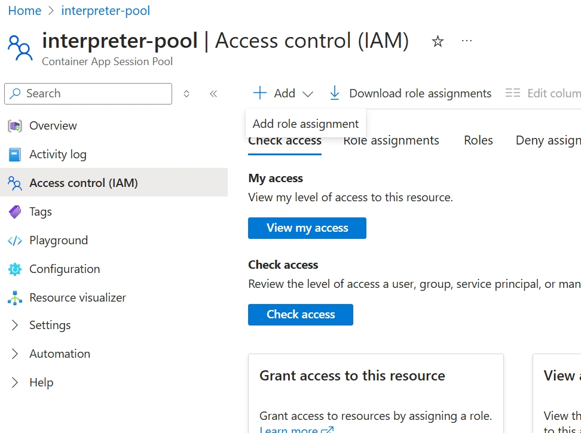
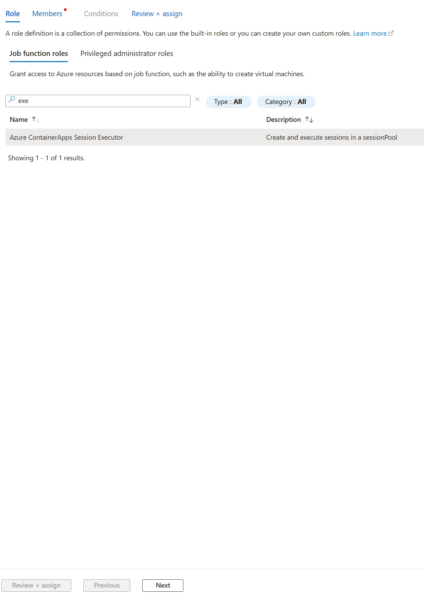
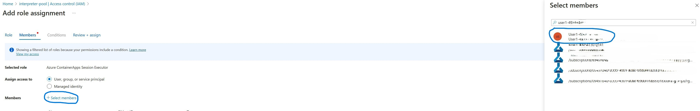

### Instructions

1. Open [`exercises/08_generate_run_code_in_remote_container_on_aca_langchain.py`](/exercises/08_generate_run_code_in_remote_container_on_aca_langchain.py)
2. Implement the `RemoteExecutor` class:
   - Initialize parameters for connection to Azure Container Apps
   - Implement the `execute_code_blocks` method to run code in a remote container
3. Complete the `run_remote_coding_agents` function:
   - Load environment variables
   - Set up the agent runtime
   - Initialize the model client and remote executor
   - Register the assistant and executor agents
   - Start the runtime and publish an initial message
4. Documentation is available here: [Autogen Docs](https://microsoft.github.io/autogen/stable/index.html); [LangChain](https://api.python.langchain.com/en/latest/tools/langchain_azure_dynamic_sessions.tools.sessions.SessionsPythonREPLTool.html)

### Expected Outcome

A system that can generate and execute code in a secure, remote container environment.

===

## Exercise 9: Group Chat Coding Problem with Semantic Kernel

### Objective

Set up a group chat between two agents using Semantic Kernel to solve coding problems.

### Instructions

1. Open [`exercises/09_group_chat_coding_problem_sk.py`](/exercises/09_group_chat_coding_problem_sk.py)
2. Implement the missing functions:
   - `create_code_agent`: Create an agent specialized in executing Python code
     - Configure the Python code interpreter tool
     - Add the code interpreter plugin to the kernel
     - Create a ChatCompletionAgent with appropriate description
   - `create_chat_agent`: Create a chat agent that interacts with users and coordinates with the code agent
   - Complete the `main` function to:
     - Create the agents
     - Set up an agent group chat
     - Create a chat history with initial system message
     - Add the user question and start the group chat
     - Display messages from each agent
3. Documentation is available here: [Autogen Docs](https://microsoft.github.io/autogen/stable/index.html); [Semantic Kernel](https://learn.microsoft.com/en-us/semantic-kernel/)

### Expected Outcome

A group chat where agents collaborate to solve coding problems, with one agent generating code and another executing it.

===

## Conclusion

Congratulations on completing the MultiagentHackathon exercises! You've learned how to create and manage various types of agent systems, from simple single-agent interactions to complex multi-agent collaborations with code execution capabilities.

### Next Steps

1. Try modifying the agents' system prompts to see how it affects their behavior
2. Experiment with different termination conditions
3. Create your own multi-agent system for a specific use case
4. Explore more advanced features like:
   - Memory and state management
   - Tool use and function calling
   - Integration with external APIs

We welcome your contributions and feedback to improve this hackathon. Please submit issues or pull requests to the repository.

Happy coding!
